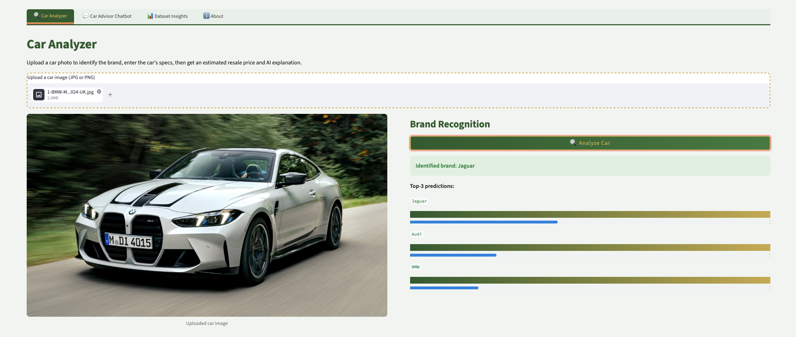
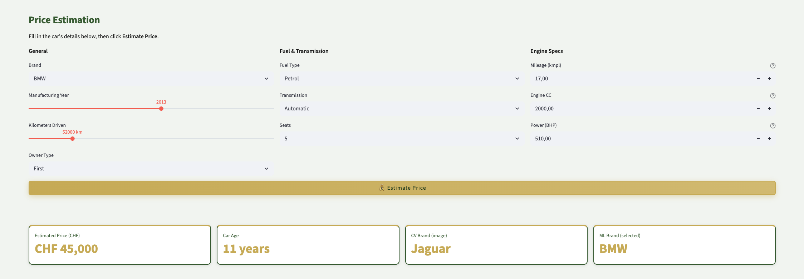
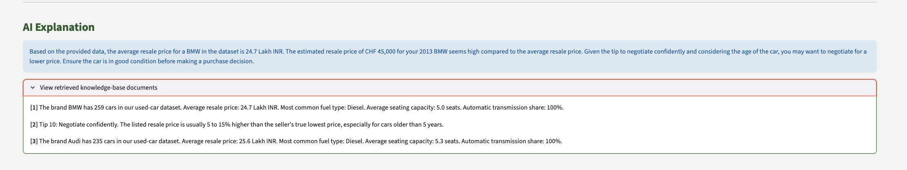
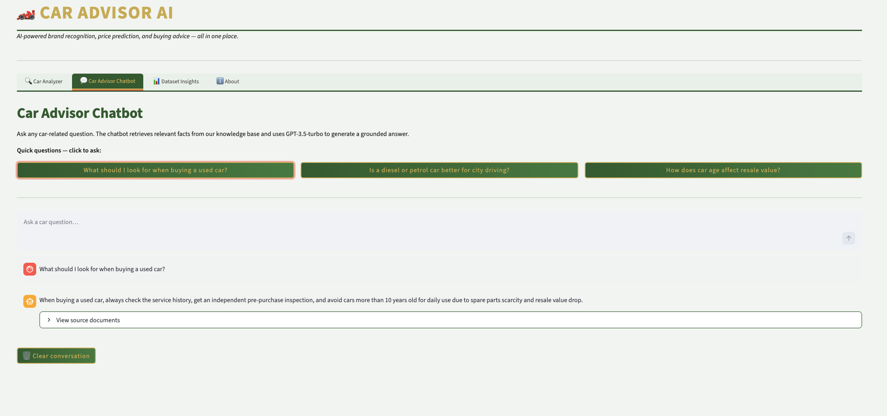
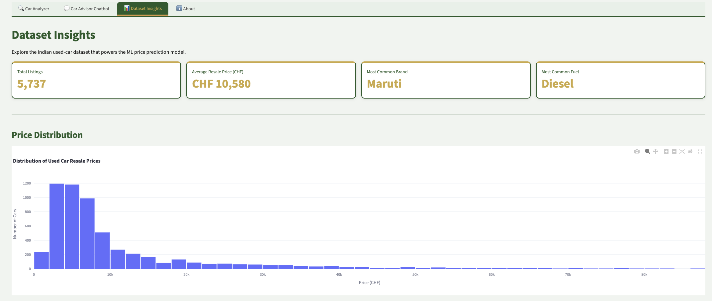
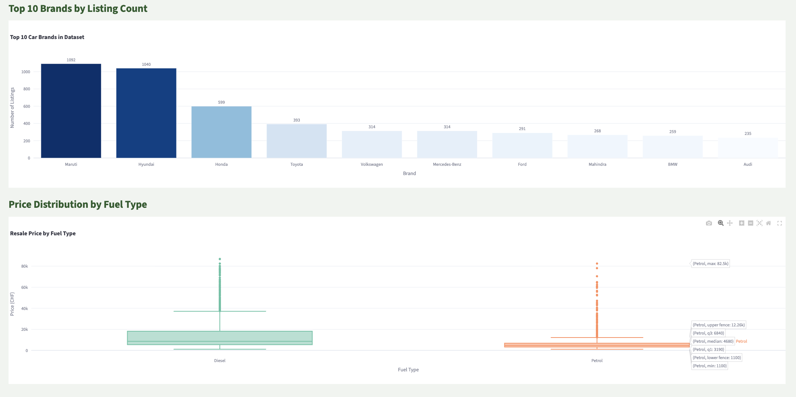

# AI Applications Project Documentation

## Project Metadata

- **Project title:** Car Advisor AI – Automated Brand Recognition, Price Estimation & Buying Advice
- **Student:** Daniele (Danydarizzler)
- **GitHub repository URL:** https://github.com/dannydarizzler/ai-applications-project
- **Deployment URL:** https://car-advisor-ai.streamlit.app
- **Submission date:** 07 June 2026

### Mandatory Setup Checks

- [x] At least 2 blocks selected
- [x] Multiple and different data sources used
- [x] Deployment URL provided
- [x] Required GitHub users added to repository (`jasminh`, `bkuehnis`)

## Selected AI Blocks

- [x] ML Numeric Data
- [x] NLP
- [x] Computer Vision

Primary blocks used for core solution:
- **Primary block 1:** Computer Vision (ResNet18 – car brand classification from image)
- **Primary block 2:** ML Numeric Data (Random Forest – used car price prediction)

The third block (NLP/RAG) is implemented as extra work and documented separately.

---

## 1. Project Foundation

### 1.1 Problem Definition
- **Problem statement:** A user has a photo of a car and basic specifications. How can AI help identify the brand, estimate a fair resale price, and provide personalised buying advice — all in one pipeline?
- **Goal:** Build an end-to-end AI application combining Computer Vision, Machine Learning, and NLP into a single coherent user-facing product.
- **Success criteria:**
  - CV block achieves >75% Top-1 accuracy on held-out test images
  - ML block achieves R² > 0.85 on the test split
  - NLP block provides factually grounded answers using retrieved context
  - All three blocks are integrated in a working Streamlit deployment

### 1.2 Integration Logic
- **How the selected blocks interact:**
  1. User uploads a car photo → CV model predicts the brand
  2. Predicted brand + user-entered specs → ML model estimates the resale price
  3. Predicted brand + price + specs → RAG pipeline generates a natural-language explanation and buying advice
- **Data and output flow between blocks:**

```text
car_image.jpg  +  user specs
       |
  [Block 1 — CV]
  ResNet18 → brand name (e.g. "BMW")
       |
  [Block 2 — ML]
  Random Forest → price in CHF (e.g. "CHF 8,250")
       |
  [Block 3 — NLP/RAG]
  FAISS retrieve → GPT-3.5-turbo → explanation + buying advice
       |
  Streamlit UI → user
```

See [`app/app.py`](app/app.py) for the full integration pipeline.

---
## 2. Block Documentation

### 2A. ML Numeric Data

#### 2A.1 Data Source(s)

| Entry | Source name or link | Type | Size | Role in this block |
| --- | --- | --- | --- | --- |
| 1 | [Used Car Auction Prices – Kaggle](https://www.kaggle.com/datasets/tunguz/used-car-auction-prices) | CSV (tabular) | 5,847 rows × 14 columns | Primary training data for price prediction |
| 2 | Engineered features (Brand, Car_Age) | Derived | Same dataset | Feature engineering output used as model input |

#### 2A.2 Preprocessing and Features

- **Cleaning steps:** See *Section 2 – Data Cleaning* in [`notebooks/01_eda.ipynb`](notebooks/01_eda.ipynb):
  - Dropped `New_Price` column (86% missing values)
  - Removed rows with missing `Mileage`, `Engine`, `Power`, `Seats`
  - Stripped units from string columns (`km/kg`, `CC`, `bhp`) and cast to float
  - Removed price outliers: kept rows where `1 ≤ Price ≤ 80` Lakh
  - Final dataset: 5,737 rows

- **Preprocessing steps:** See *Section 4 – Feature Engineering* in [`notebooks/01_eda.ipynb`](notebooks/01_eda.ipynb):
  - One-Hot Encoding for `Fuel_Type`, `Transmission`, `Owner_Type`
  - Ordinal Encoding for `Brand` (too many categories for OHE)
  - MinMaxScaler on numeric features: `Kilometers_Driven`, `Engine`, `Power`, `Mileage`, `Car_Age`

- **Feature engineering and selection:**
  - Extracted `Brand` from the `Name` column (first word)
  - Created `Car_Age = 2024 − Year`
  - Final feature set: 15 features

#### 2A.3 Model Selection

- **Models tested:** Linear Regression (baseline), Random Forest Regressor, Gradient Boosting (XGBoost/sklearn GBR)
- **Why these models were chosen:**
  - Linear Regression as interpretable baseline
  - Random Forest handles non-linear relationships and mixed feature types well
  - Gradient Boosting for comparison against Random Forest

#### 2A.4 Model Comparison and Iterations

| Iteration | Objective | Key changes | Models used | Main metric (Test R²) | Change vs previous |
| --- | --- | --- | --- | --- | --- |
| 1 | Baseline | Raw features, no tuning | Linear Regression | R² = 0.52 | — |
| 2 | Improve with non-linear model | Random Forest n=100 | Random Forest | R² = 0.90 | +0.38 |
| 3 | Hyperparameter tuning | GridSearchCV 5-fold, tuned `n_estimators`, `max_depth`, `min_samples_split` | Tuned Random Forest | R² = 0.91 | +0.01 |

See *Section 5 – Hyperparameter Tuning* in [`notebooks/03_ml_numeric.ipynb`](notebooks/03_ml_numeric.ipynb).

#### 2A.5 Evaluation and Error Analysis

- **Metrics used:** MAE, RMSE, R² on both train and test splits
- **Final results (Tuned Random Forest):**
  - Test R² = 0.91
  - Test RMSE = 3.26 Lakh (~CHF 3,590)
  - Test MAE ≈ 2.1 Lakh (~CHF 2,310)
- **Error patterns and likely causes:** See *Section 6 – Comparison & Error Analysis* in [`notebooks/03_ml_numeric.ipynb`](notebooks/03_ml_numeric.ipynb):
  - Largest errors occur on high-end luxury cars (Audi, BMW) and very old vehicles — the training distribution is dominated by budget Indian brands
  - Power (BHP) is the single strongest predictor; luxury cars with high BHP but few training examples cause systematic underestimation
  - The model performs best for Indian brands (Maruti, Hyundai, Honda) which are well-represented in the training data

#### 2A.6 Integration with Other Block(s)

- **Inputs received from other block(s):** Predicted brand name from CV block (Block 1), used as an encoded feature via `brand_encoder.pkl`
- **Outputs provided to other block(s):** Predicted price in Lakh INR → converted to CHF and passed as context to the RAG block (Block 3) for explanation generation

See *Section 7 – Integration with CV Block* in [`notebooks/03_ml_numeric.ipynb`](notebooks/03_ml_numeric.ipynb) and [`app/app.py`](app/app.py).

---

### 2B. NLP

#### 2B.1 Data Source(s)

| Entry | Source name or link | Type | Size | Role in this block |
| --- | --- | --- | --- | --- |
| 1 | Processed used-car dataset (`used_cars_clean.csv`) | CSV (derived) | 5,737 rows | Source for brand-level summary documents |
| 2 | Manually authored car-buying tips | Text (authored) | 10 documents | Background knowledge for RAG |
| 3 | Feature explanation texts | Text (authored) | 15 documents | Explain domain terms (BHP, CC, Lakh) to users |
| 4 | Wikipedia REST API (10 car brands) | External text (API) | 10 summaries | Real-world brand knowledge for RAG |

#### 2B.2 Preprocessing and Prompt Design

- **Text preprocessing:** Brand summary documents generated programmatically from dataset statistics (mean price, most common fuel type, average km). See *Section 2 – Knowledge Base* in [`notebooks/04_nlp_rag.ipynb`](notebooks/04_nlp_rag.ipynb).
- **External sources:** Wikipedia REST API summaries fetched for top 10 brands (BMW, Toyota, Honda, Hyundai, Maruti, Volkswagen, Audi, Mercedes-Benz, Ford, Mahindra) via `requests` library — adds real-world factual grounding to the knowledge base. See *Section 2.4 – External Wikipedia Sources* in [`notebooks/04_nlp_rag.ipynb`](notebooks/04_nlp_rag.ipynb).
- **Prompt design:** XML-tagged prompt structure as taught in course:
System: You are an expert car advisor assistant.
User:
<context>{retrieved_documents}</context>
<question>{user_question}</question>
Answer based on the context. Be concise and helpful.
  See *Section 4 – Prompt Engineering* in [`notebooks/04_nlp_rag.ipynb`](notebooks/04_nlp_rag.ipynb).

#### 2B.3 Approach Selection

- **Approach used:** Retrieval-Augmented Generation (RAG) with `all-MiniLM-L6-v2` embeddings stored in a FAISS IndexFlatIP vector index, and OpenAI GPT-3.5-turbo as the generative model
- **Alternatives considered:** Pure prompt engineering without retrieval (Prompt A in comparison), RAG without system role (Prompt B in comparison)

#### 2B.4 Comparison and Iterations

| Iteration | Objective | Key changes | Model or prompt setup | Qualitative check | Change vs previous |
| --- | --- | --- | --- | --- | --- |
| 1 | Bare LLM baseline | No context, no system role | GPT-3.5-turbo plain | Generic answer, no domain facts | — |
| 2 | Add retrieval context | FAISS top-3 docs injected, no system role | GPT-3.5-turbo + RAG | More factual, but less focused | More grounded |
| 3 | Full RAG with structured prompt | XML tags + system role added | GPT-3.5-turbo + RAG + system role | Concise, factual, correctly scoped | Best quality |

**Integration impact measurement:** The prompt comparison directly demonstrates how RAG context changes the ML price prediction explanation. Prompt A (no context) gives a generic answer with no price reference. Prompt B (RAG, no structure) mentions the price but lacks focus. Prompt C (full RAG + XML structure) explicitly references the predicted CHF price from the ML block, retrieves brand-specific market data from the knowledge base, and generates a grounded buying recommendation — showing a measurable qualitative improvement in answer relevance and factual grounding. See *Section 5 – Prompt Comparison* in [`notebooks/04_nlp_rag.ipynb`](notebooks/04_nlp_rag.ipynb).

#### 2B.5 Evaluation and Error Analysis

- **Evaluation strategy:** Qualitative comparison of three prompt strategies on identical questions; manual inspection of retrieved documents vs generated answers
- **Results:** Full RAG with XML-structured prompt (Iteration 3) consistently outperforms bare LLM and unstructured RAG
- **Error patterns and likely causes:**
  - Knowledge base contains 64 documents (54 domain-specific + 10 Wikipedia summaries); rare queries may still fall back to LLM general knowledge
  - US/European car brands (e.g. Dodge, Ford Mustang) have no matching brand summaries in the knowledge base since the dataset covers only Indian market vehicles

#### 2B.6 Integration with Other Block(s)

- **Inputs received from other block(s):** Predicted brand (CV), estimated price in CHF (ML), and user-entered specs — all assembled into the RAG query string
- **Outputs provided to other block(s):** Natural-language explanation displayed in the Streamlit UI; also powers the standalone chatbot tab

See [`app/app.py`, `rag_answer()` function](app/app.py) for the full pipeline implementation.

---

### 2C. Computer Vision

#### 2C.1 Data Source(s)

| Entry | Source name or link | Type | Size | Role in this block |
| --- | --- | --- | --- | --- |
| 1 | [The Car Connection Picture Dataset – Kaggle](https://www.kaggle.com/datasets/prondeau/the-car-connection-picture-dataset) | Images (JPG) | 64,467 images, 42 brands | Training and evaluation of brand classifier |

#### 2C.2 Preprocessing and Augmentation

- **Image preprocessing:** Resize to 224×224, ToTensor, Normalize with ImageNet mean/std `[0.485, 0.456, 0.406]` / `[0.229, 0.224, 0.225]`
- **Augmentation strategy (training only):** RandomHorizontalFlip, RandomRotation(10°), ColorJitter — applied only during training to improve generalisation; validation/test use resize + normalize only

See *Section 3 – Preprocessing & Augmentation* in [`notebooks/02_cv_model.ipynb`](notebooks/02_cv_model.ipynb).

#### 2C.3 Model Selection

- **Vision model used:** ResNet18 pretrained on ImageNet (torchvision)
- **Why this model was chosen:**
  - ImageNet-pretrained weights provide strong general visual features (Transfer Learning as taught in course)
  - ResNet18 is lightweight enough to train on CPU/MPS within reasonable time
  - Final fully connected layer replaced: 512 → 42 classes

#### 2C.4 Model Comparison and Iterations

| Iteration | Objective | Key changes | Model(s) used | Main metric | Change vs previous |
| --- | --- | --- | --- | --- | --- |
| 1 | Frozen feature extractor | All layers frozen, only FC trained, lr=0.001, 5 epochs | ResNet18 (frozen) | Val Acc ≈ 62% | — |
| 2 | Fine-tuning | All layers unfrozen, lr=0.0001, 5 more epochs | ResNet18 (fine-tuned) | Top-1 = 82.44% | +~20% |

See *Section 4 – Transfer Learning* and *Section 5 – Fine-Tuning* in [`notebooks/02_cv_model.ipynb`](notebooks/02_cv_model.ipynb).

#### 2C.5 Evaluation and Error Analysis

- **Metrics:** Top-1 accuracy, Top-3 accuracy, per-class precision/recall/F1 (classification report), row-normalised confusion matrix for top-10 brands
- **Final results:**
  - **Top-1 Accuracy: 82.44%**
  - **Top-3 Accuracy: 90.36%**
- **Error patterns and limitations:** See *Section 6 – Evaluation* in [`notebooks/02_cv_model.ipynb`](notebooks/02_cv_model.ipynb):
  - Brands with shared platform DNA (Chevrolet/GMC, Audi/Volkswagen) are frequently confused due to similar visual features
  - Unusual viewpoints (interior shots, close-ups, rear-quarter angles) reduce accuracy — ResNet18's global average pooling loses spatial detail
  - Class imbalance: Chevrolet has ~5,000 images vs smallest brand ~50; model biases toward high-frequency classes when uncertain
  - **CV↔ML brand mismatch:** The CV model is trained on US-market images (Car Connection dataset) while the ML model uses Indian market data. Brands like Maruti or Tata are rarely predicted by CV but dominate the ML training data. This is documented as a known limitation; the user can manually correct the brand in the price estimation form.

#### 2C.6 Integration with Other Block(s)

- **Inputs received from other block(s):** Raw user-uploaded image (JPEG/PNG)
- **Outputs provided to other block(s):** Top-1 predicted brand name → passed as input feature to ML block (Block 2) for price prediction; also used to pre-fill the brand selector in the Streamlit UI

See [`app/app.py`, `cv_predict()` function](app/app.py).

---

## 3. Deployment

- **Deployment URL:** https://car-advisor-ai.streamlit.app
- **Main user flow:**
  1. User uploads a car photo in the **Car Analyzer** tab
  2. Clicks "Analyze Car" → ResNet18 identifies the brand with Top-3 confidence bars
  3. Form pre-fills with brand-typical default values (year, km, engine, power)
  4. User adjusts specs and clicks "Estimate Price" → Random Forest returns CHF estimate
  5. RAG pipeline generates an AI explanation with FAISS-retrieved context
  6. User can continue conversation in the **Car Advisor Chatbot** tab
  7. **Dataset Insights** tab shows interactive Plotly charts of the training data

### App Screenshots

**Step 1 – Car Brand Recognition (Computer Vision Block)**


**Step 2 – Price Estimation (ML Numeric Block)**


**Step 3 – AI Explanation (NLP/RAG Block)**


**Step 4 – Car Advisor Chatbot (NLP/RAG Block)**


**Step 5 – Dataset Insights (EDA)**



---

## 4. Execution Instructions

### Environment setup
```bash
# Clone the repository
git clone https://github.com/dannydarizzler/ai-applications-project.git
cd ai-applications-project

# Install dependencies
pip install -r app/requirements.txt
```

### API key setup
Create a `.env` file in the project root:
```
OPENAI_API_KEY=sk-proj-your-key-here
```
### Data setup
1. Download [Used Car Auction Prices](https://www.kaggle.com/datasets/tunguz/used-car-auction-prices) → place `train.csv` in `data/raw/used_cars/`
2. Download [Car Connection Picture Dataset](https://www.kaggle.com/datasets/prondeau/the-car-connection-picture-dataset) → place all images in `data/raw/Auto_Bilder/`

### Training / notebook execution (in order)
```bash
# Run all notebooks in order:
jupyter notebook notebooks/01_eda.ipynb          # EDA + preprocessing → saves data/processed/
jupyter notebook notebooks/02_cv_model.ipynb     # CV training → saves models/car_brand_classifier.pth
jupyter notebook notebooks/03_ml_numeric.ipynb   # ML training → saves models/price_predictor.pkl
jupyter notebook notebooks/04_nlp_rag.ipynb      # RAG setup → saves models/faiss_index.bin
```

> **Note for Notebook 2:** Set `MAX_PER_CLASS = 200` for faster training on CPU (~45 min). Full dataset (`MAX_PER_CLASS = None`) takes ~80 min on Apple Silicon.

### Run the app locally
```bash
cd app
streamlit run app.py
```

### Reproducibility notes
- All notebooks use `random_state=42`
- Python 3.12, PyTorch 2.x, scikit-learn 1.3+
- Full dependency versions in `app/requirements.txt`

---

## 5. Optional Bonus Evidence

- [x] **Third selected block implemented with strong quality** — NLP/RAG block fully implemented with FAISS vector store, sentence-transformers embeddings, and GPT-3.5-turbo; prompt comparison across 3 strategies documented in `notebooks/04_nlp_rag.ipynb`
- [x] **More than two data sources used with clear added value** — 4 distinct data sources: Car Connection images (CV), Indian Used Car Market CSV (ML), manually authored knowledge base documents (NLP), Wikipedia REST API summaries for 10 brands (NLP)
- [x] **Extended evaluation** — Top-1 and Top-3 accuracy for CV; MAE + RMSE + R² for ML; qualitative prompt comparison for NLP; confusion matrix and per-class F1 report
- [x] **Ethics, bias, or fairness analysis**:
  - Price data is based on the Indian market; CHF conversion uses a fixed approximate rate (1 INR ≈ 0.011 CHF) — prices are indicative only, not financial advice
  - CV model trained on US-market images; Indian brands (Maruti, Tata) are underrepresented and may show lower accuracy
  - ML model systematically underestimates prices for luxury/sports cars due to class imbalance in training data
  - User-uploaded images are not stored or used for any further training
  - Currency and market bias is disclosed in the app sidebar and About tab
- [x] **Creative or exceptional use case** — Complete end-to-end pipeline answering a real-world question ("I have a car photo — what is it worth and should I buy it?") combining three AI modalities in a single, coherent user interaction
